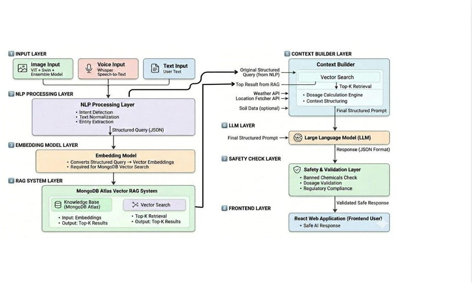
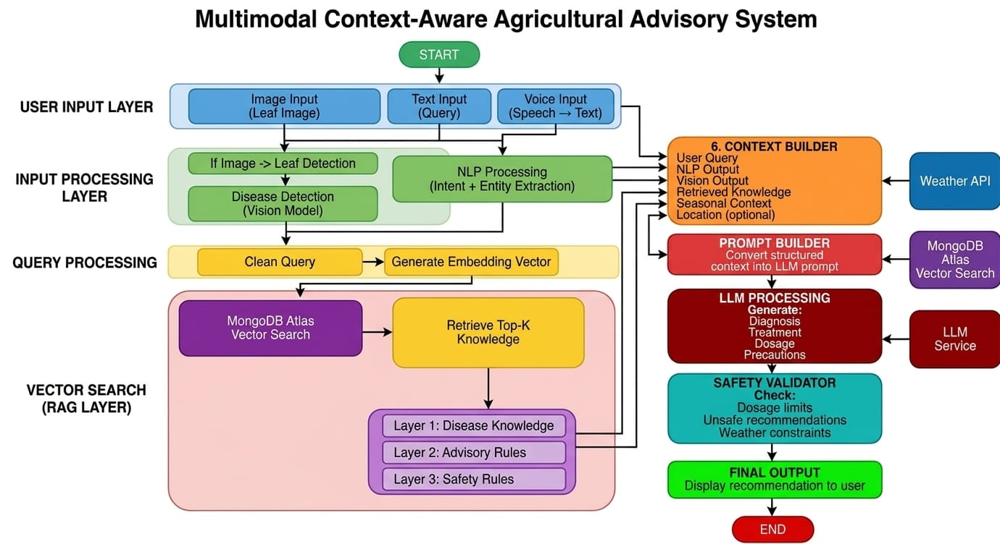

<div align="center">
  
</div>

<h1 align="center">Multimodal Context-Aware Agricultural Advisory System</h1>

<div align="center">
  <i>An advanced, microservice-based AI ecosystem designed to empower farmers with real-time agronomic insights, highly resilient multimodal disease detection, and hyper-local weather intelligence.</i>
  <br/><br/>
  <a href="https://agri-ai-five-iota.vercel.app?_vercel_share=WF12kiNAVgjIQAkLaSQjYX3OdFT6A4qm"><b>🚀 View Live Production Demo</b></a>
</div>

---

## 📖 Executive Summary & Motivation
Agriculture remains the backbone of the global economy, yet thousands of farmers suffer devastating crop losses simply due to misidentified diseases, unpredictable weather shifts, and systemic lack of access to agricultural experts. While commercial farms leverage expensive IoT sensors and drones, smallholder and rural farmers are often left behind with nothing but a basic smartphone.

**The Vision:** Build a world-class agronomist, meteorologist, and diagnostic laboratory strictly accessible through an intuitive, low-bandwidth mobile interface. 

This project bridges the technology gap by bringing sophisticated **Multimodal AI (Voice, Vision, and Text)** to the palms of farmers. Designed with deep resilience and hybrid-fallback architectures, the platform ensures rapid intelligence delivery regardless of API rate limits, out-of-domain interactions, or language barriers.

---

## ⚙️ Core Architecture & Component Deep Dive
This repository doesn't just feature a basic chatbot; it represents a **full-stack asynchronous microservices architecture** built to handle complex edge cases and real-time processing.

### 1. Intelligent Input Routing (NLP Engine)
At the heart of the system is a proprietary NLP module `AgriculturalNLPModule` that instantly classifies user intent.
- **Dynamic Entity Extraction:** Automatically detects crops, diseases, and dynamically catches target locations (e.g., *"weather in Chennai"*) using custom Regex engines to bypass faulty mobile IP-address geolocation.
- **Strict OOD Gating:** Employs comprehensive "Out-of-Domain" (OOD) filtering to politely reject non-agricultural prompts (e.g., sports, politics, media), saving LLM token expenditure and maintaining context integrity.

### 2. Multimodal Processing Pipelines
- **Computer Vision (Disease Diagnostics):** Uploaded leaf images are streamed into a dedicated Vision endpoint. Results pass through a strict **Confidence Tiering Gate**. If a user uploads a selfie or a random object, the system detects the anomaly (`confidence < 0.10`) and securely rejects the input, instructing the LLM to guide the farmer to take a valid leaf photo.
- **Native Voice Dictation:** Farmers can interact via localized voice processing. The mobile frontend relies on a dynamic, asynchronous "Tap-to-Toggle" recording interface designed specifically to circumvent Android/iOS event-dropping issues. The backend proxy intelligently handles audio format conversions and feeds it to the LLM.

### 3. Real-Time RAG (Retrieval-Augmented Generation)
- Instead of relying on LLM hallucinations, agronomic queries trigger a sophisticated RAG pipeline.
- The user's query is vectorized using local `SentenceTransformers` and matched against a curated, dense knowledge base hosted on **MongoDB Atlas Vector Search**.
- Top-K semantic matches are dynamically injected into the LLM context window alongside the Vision module's disease predictions.

### 4. Hyper-Resilient Weather Intelligence
The weather service guarantees zero downtime using a custom 3-Tier Fallback Chain:
1. **Primary Layer:** Securely queries *Open-Meteo* for highly accurate, free 10-day forecasts and hourly precipitation matrices.
2. **Secondary Fallback:** If rate limits are triggered (HTTP 429), it automatically fails over to a parsed `wttr.in` text-based endpoint using HTTpx.
3. **Tertiary Fallback:** Generates synthetically realistic mock forecasts based on geographic trends to permanently prevent frontend crashes.

### 5. Large Language Model (LLM) Engine
- Powered by an ultra-fast **Groq (Llama 3)** primary inference node for zero-latency streaming.
- Employs a fully automated fallback to **Google Gemini 1.5** in the event of upstream Groq timeouts.
- Injects a complete contextual payload into the prompt, containing: `[NLP Intent] + [Vector RAG Context] + [Vision Classifications] + [Extracted Hyperlocal Weather Data]`.

---

## 🏗️ System Architecture Models

### 1. High-Level Architecture Diagram
The architecture is designed for extreme low latency, modular isolation, and robust scaling across independent FastAPI microservices.

<div align="center">
  
</div>

### 2. Data Flow (DF) Diagram
The pipeline ensures that user intent and multimodal context are carried securely through every execution layer before converging at the LLM synthesis node.

<div align="center">
  
</div>

---

## 🛠️ Technology Stack
This platform implements modern, production-grade tools aligned with strict industry standards.

### Frontend Application
- **Core:** `React.js` (Vite)
- **Styling Architecture:** Mobile-first, responsive Glassmorphic UI with advanced Flex-containers (`100dvh` bound, dynamic `useEffect` adaptive sizing for dynamic LLM content).
- **Safety:** Real-time CSS truncation, markdown bounding, and robust cross-platform dictation support.
- **Hosting:** Vercel Global Edge Network.

### Backend Microservices
- **Core:** `FastAPI` + `Python 3.10+` running fully asynchronous (`httpx`, `asyncio`, `Tenacity` retries).
- **AI/ML Layer:** HuggingFace `transformers`, Google `genai`, Groq ultra-fast inference.
- **Vector Database:** `MongoDB Atlas Vector Search` (Cloud-hosted NoSQL).
- **External Dependencies:** Open-Meteo, GTx Voice APIs.
- **Hosting:** Render Cloud Infrastructure.

---

## 🚀 Setting Up Locally

**System Prerequisites:** `Python 3.10+` | `Node.js 18+` | `Git`

**1. Clone the repository**
```bash
git clone https://github.com/your-username/agri-ai.git
cd agri-ai
```

**2. Backend Setup**
```bash
# Initialize virtual environment structure
python -m venv venv
source venv/bin/activate  # On Windows use: venv\Scripts\activate

# Install critical dependencies
pip install -r requirements.txt

# Start the asynchronous FastAPI mesh
python run_api.py
```

**3. Frontend Setup**
```bash
cd frontend
npm install

# Boot development server
npm run dev
```

---

## 📜 Open Source
This system represents a robust technical demonstration of AI applied to socio-economic challenges. It is completely open-source and free to explore.

<br/>
<br/>

<div align="center">
  
</div>
