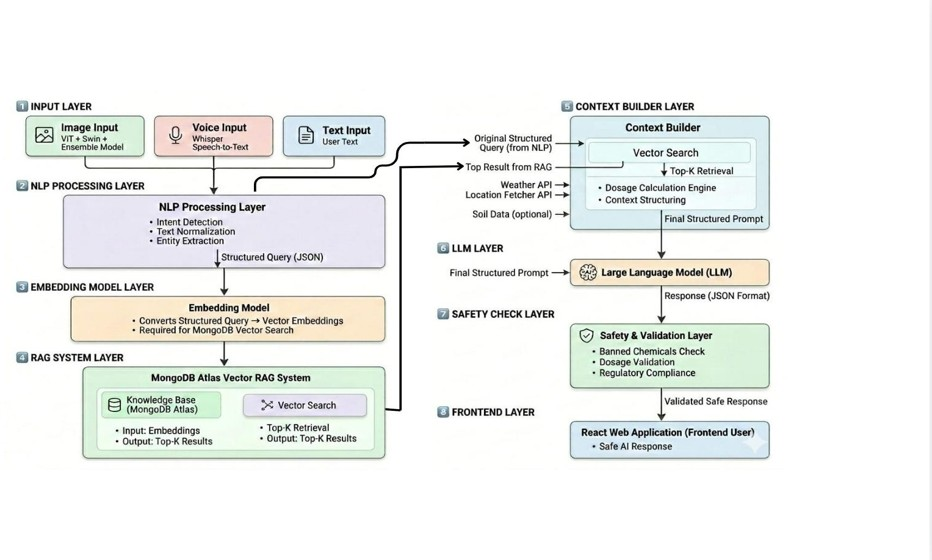
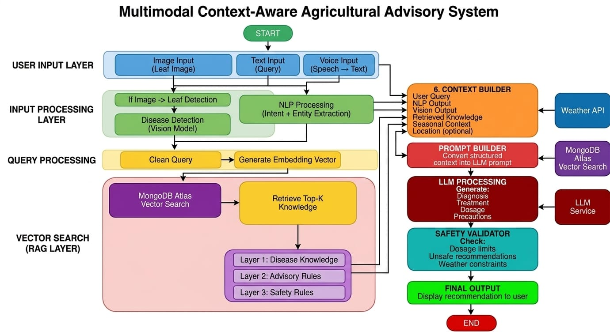

````markdown
<div align="center">
  
</div>

<h1 align="center">Multimodal Context-Aware Agricultural Advisory System</h1>

<div align="center">
  <i>An advanced, microservice-based AI ecosystem designed to empower farmers with real-time agronomic insights, highly resilient multimodal disease detection, and hyper-local weather intelligence.</i>
  <br/><br/>
  <a href="https://agri-ai-five-iota.vercel.app?_vercel_share=WF12kiNAVgjIQAkLaSQjYX3OdFT6A4qm"><b>🚀 View Live Production Demo</b></a>
</div>

---

## 📖 Executive Summary & Motivation

Agriculture remains the backbone of the global economy, yet thousands of farmers suffer devastating crop losses simply due to misidentified diseases, unpredictable weather shifts, and systemic lack of access to agricultural experts. While commercial farms leverage expensive IoT sensors and drones, smallholder and rural farmers are often left behind with nothing but a basic smartphone.

**The Vision:** Build a world-class agronomist, meteorologist, and diagnostic laboratory strictly accessible through an intuitive, low-bandwidth mobile interface.

This project bridges the technology gap by bringing sophisticated **Multimodal AI (Voice, Vision, and Text)** to the palms of farmers. Designed with deep resilience and hybrid-fallback architectures, the platform ensures rapid intelligence delivery regardless of API rate limits, out-of-domain interactions, or language barriers.

---

# ⚙️ Core Architecture & Component Deep Dive

This repository doesn't just feature a basic chatbot; it represents a **full-stack asynchronous microservices architecture** built to handle complex edge cases and real-time processing.

## 1. Intelligent Input Routing (NLP Engine)

At the heart of the system is a proprietary NLP module `AgriculturalNLPModule` that instantly classifies user intent.

- Dynamic Entity Extraction using custom Regex engines.
- Automatic crop, disease, and location detection.
- Strict Out-of-Domain (OOD) filtering.
- Context-aware agricultural intent routing.

## 2. Multimodal Processing Pipelines

### Computer Vision

- Leaf disease detection.
- Confidence-based prediction filtering.
- Invalid image rejection.
- Guided image recapture.

### Voice AI

- Localized speech recognition.
- Cross-platform recording support.
- Backend audio preprocessing.
- AI-powered transcription.

## 3. Retrieval-Augmented Generation (RAG)

- MongoDB Atlas Vector Search.
- SentenceTransformers embeddings.
- Semantic document retrieval.
- Context injection into LLM.

## 4. Hyper-Resilient Weather Intelligence

Three-tier weather fallback system:

1. Open-Meteo API
2. wttr.in fallback
3. Intelligent synthetic forecast generation

## 5. Large Language Model

- Groq (Llama 3) primary inference
- Google Gemini fallback
- Context-aware prompt orchestration
- Weather + Vision + RAG + NLP synthesis

---

# 🏗️ System Architecture Models

## High-Level Architecture

<div align="center">
  
</div>

## Data Flow Diagram

<div align="center">
  
</div>

---

# 🛠 Technology Stack

## Frontend

- React.js (Vite)
- JavaScript
- HTML5
- CSS3
- Responsive Mobile UI
- Markdown Rendering
- Speech Recognition API
- Vercel

## Backend

- FastAPI
- Python 3.10+
- AsyncIO
- HTTPX
- Tenacity
- HuggingFace Transformers
- Groq API
- Google Gemini
- MongoDB Atlas
- Open-Meteo API
- Render

---

# 🚀 Local Installation

## Requirements

- Python 3.10+
- Node.js 18+
- Git

## Clone Repository

```bash
git clone https://github.com/your-username/agri-ai.git
cd agri-ai
````

## Backend

```bash
python -m venv venv

# Windows
venv\Scripts\activate

# Linux / macOS
source venv/bin/activate

pip install -r requirements.txt

python run_api.py
```

## Frontend

```bash
cd frontend

npm install

npm run dev
```

---

# 🔒 License & Copyright

**Copyright © 2026 Hariprasanth U. All Rights Reserved.**

This repository and all associated materials are proprietary intellectual property owned exclusively by **Hariprasanth U**.

This project is made publicly available **only for viewing, learning about its architecture, and portfolio evaluation**.

## Permitted Use

You may:

* View the repository on GitHub.
* Evaluate the project for educational, recruitment, or portfolio purposes.

## Prohibited Without Written Permission

You may **NOT**:

* Copy any source code.
* Clone and redistribute this repository.
* Modify the project.
* Create derivative works.
* Re-upload this project anywhere.
* Publish the source code.
* Sell or commercialize any part of this software.
* Use this project in commercial, production, or academic submissions.
* Remove copyright notices.
* Reverse engineer proprietary implementations.
* Train AI models using this repository or its contents.
* Copy the UI/UX, architecture, workflows, prompts, APIs, documentation, images, assets, or branding.

## Protected Intellectual Property

The following are protected and remain the exclusive property of the copyright holder:

* Complete source code
* Backend architecture
* Frontend implementation
* AI workflows
* NLP engine
* Vision pipeline
* Weather intelligence system
* RAG implementation
* Database design
* API architecture
* UI/UX design
* Documentation
* Images
* Graphics
* Icons
* Branding
* Logos
* Project name
* Technical documentation

Any unauthorized copying, reproduction, modification, redistribution, deployment, or commercial use of this software, in whole or in part, is strictly prohibited and may result in legal action under applicable copyright and intellectual property laws.

---

# 📄 License

This repository is distributed under a **Proprietary "All Rights Reserved" License**.

No license is granted to use, modify, copy, distribute, sublicense, or commercialize this software.

For licensing inquiries, commercial partnerships, or permission requests, please contact the copyright holder before using any part of this project.

---

<div align="center">

### ⚠ Repository Notice

This repository is publicly visible for **portfolio demonstration and technical evaluation only**.

**It is NOT Open Source.**

No permission is granted to copy, modify, redistribute, reuse, or deploy this project without the explicit written consent of **Hariprasanth U**.

**© 2026 Hariprasanth U. All Rights Reserved.**

</div>

---

<div align="center">
  
</div>
```
